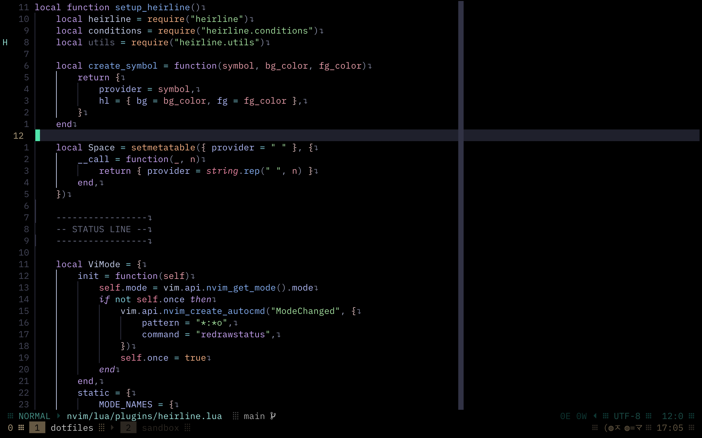

<div align="center">
  <h1>EYB's Neovim Setup</h1>
</div>



[Back to Main README](../../README.md)

## Directory Structure

```
~/.config/nvim/
├── lua/
│   ├── plugins/
│   │   ├── lsp/
│   │   │   ├── lspconfig.lua
│   │   │   ├── mason.lua
│   │   │   └── none-ls.lua
│   │   ├── colorizer.lua
│   │   ├── colorscheme.lua
│   │   ├── comment.lua
│   │   ├── dashboard-nvim.lua
│   │   ├── gitsigns.lua
│   │   ├── heirline.lua
│   │   ├── indent-blankline.lua
│   │   ├── nvim-autopairs.lua
│   │   ├── nvim-cmp.lua
│   │   ├── nvim-tree.lua
│   │   ├── nvim-treesitter.lua
│   │   └── telescope.lua
│   └── user/
│       ├── keymaps.lua
│       ├── lazy.lua
│       └── options.lua
├── init.lua
├── lazy-lock.json
└── README.md
```

## Core Plugins

These are the key plugins for core functionality:

- **Plugin Manager**: [lazy.nvim](https://github.com/folke/lazy.nvim)
- **Fuzzy Finder**: [telescope.nvim](https://github.com/nvim-telescope/telescope.nvim)
- **Completion Engine**: [nvim-cmp](https://github.com/hrsh7th/nvim-cmp)
- **Syntax Parser**: [nvim-treesitter](https://github.com/nvim-treesitter/nvim-treesitter)

## LSP

Plugins for Language Server Protocol (LSP) setup and configuration:

- **Package Manager (LSP, DAP, Linters, Formatters)**: [mason.nvim](https://github.com/williamboman/mason.nvim)
- **Code Diagnostics & Formatting**: [none-ls.nvim](https://github.com/nvimtools/none-ls.nvim)
- **LSP Configurations**: [nvim-lspconfig](https://github.com/neovim/nvim-lspconfig)

## UI

Enhance the appearance and user interface:

- **Colorscheme**: [Catppuccin Mocha](https://github.com/catppuccin/catppuccin) (Custom)
- **File Explorer**: [nvim-tree](https://github.com/nvim-tree/nvim-tree.lua)
- **Status Line**: [heirline.nvim](https://github.com/rebelot/heirline.nvim)

## Additional Plugins

Extra features and utilities:

- **Auto-Pairing Brackets**: [nvim-autopairs](https://github.com/windwp/nvim-autopairs)
- **Color Highlighter**: [nvim-colorizer.lua](https://github.com/norcalli/nvim-colorizer.lua)
- **Commenting Utility**: [Comment.nvim](https://github.com/numToStr/Comment.nvim)
- **Startup Dashboard**: [dashboard-nvim](https://github.com/nvimdev/dashboard-nvim)
- **Git Decorations**: [gitsigns.nvim](https://github.com/lewis6991/gitsigns.nvim)
- **Indentation Guides**: [indent-blankline.nvim](https://github.com/lukas-reineke/indent-blankline.nvim)
