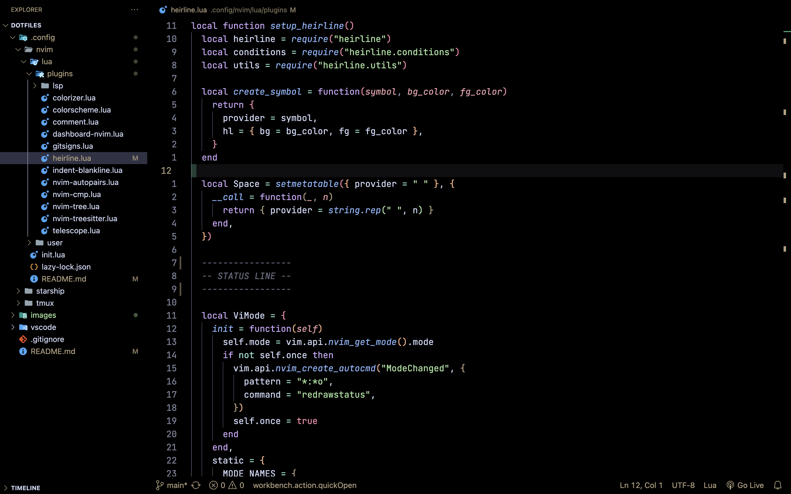
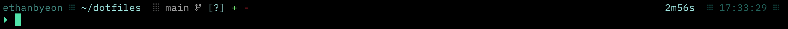
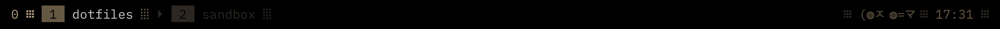

<div align="center">
    <h1>EYB's Dotfiles</h1>
</div>

<div align="center">
  

  <a href=".config/nvim/README.md">Neovim Config</a>
</div>

<br>

<div align="center">
  

  <a href="vscode/README.md">VS Code Config</a>
</div>

<br>

<div align="center">
  

  Starship Config
</div>

<br>

<div align="center">
  

  tmux Config
</div>

## Setup Overview

- **Default Shell**: [Fish](https://github.com/fish-shell/fish-shell)
- **Shell Prompt**: [Starship](https://github.com/starship/starship)
- **Terminal Multiplexor**: [tmux](https://github.com/tmux/tmux/wiki/Installing)
- **Text Editors**: [Neovim](https://github.com/neovim/neovim), [VS Code](https://code.visualstudio.com/)

## Directory Structure

```
~/dotfiles/
├── .config/
│   ├── nvim/
│   ├── starship/
│   └── tmux/
├── images/
├── vscode/
└── README.md
```

## Installation

To set up these dotfiles using GNU Stow, follow the steps below:

1. **Clone the repository**:

    ```
    git clone https://github.com/ethanbyeon/dotfiles.git dotfiles
    cd dotfiles/
    ```
2. **Install GNU Stow**

    If GNU Stow isn't already installed, use your package manager:

    For macOS (Homebrew):
    ```
    brew install stow
    ```

3. **Create Symlinks for Configurations**:

    To symlink the configuration files (e.g., for `nvim`, `zsh`, or `tmux`), run:
    ```
    stow <package>
    ```

    Replace `<package>` with the directory name of the configuration you want to symlink (e.g., `nvim`, `zsh`).

4. **Verify Installation**:

    After running the `stow` command, confirm that the configuration files are correctly placed and loaded on your system.

    For more detailed usage of Stow, including how to back up existing configurations and avoid overwriting files, see the [Using GNU Stow](#using-gnu-stow) section below.

## Using GNU Stow

[GNU Stow](https://www.gnu.org/software/stow/manual/stow.html) helps manage and symlink configuration files from your dotfiles repository to their appropriate locations. Follow these steps to set it up:

### 🔄 Backing Up Existing Configurations

To move your current configurations into your dotfiles repository, use the `--adopt` flag:
```
stow <package> --adopt
```

This command will move any existing files (e.g., `~/.zshrc`) into your dotfiles repository. Ensure the repository's directory structure matches your system's file paths.

> [!WARNING]
> The `--adopt` flag will overwrite any files in the repository with the same name as those being moved.

### 🔗 Symlinking Configurations

1. Clone the repository and navigate into its directory.

2. Create symlinks for the desired packages using Stow:
```
stow <package>
```

This will link the configuration files from your dotfiles repository to their corresponding locations on your system (e.g., `~/.config/nvim/`).
