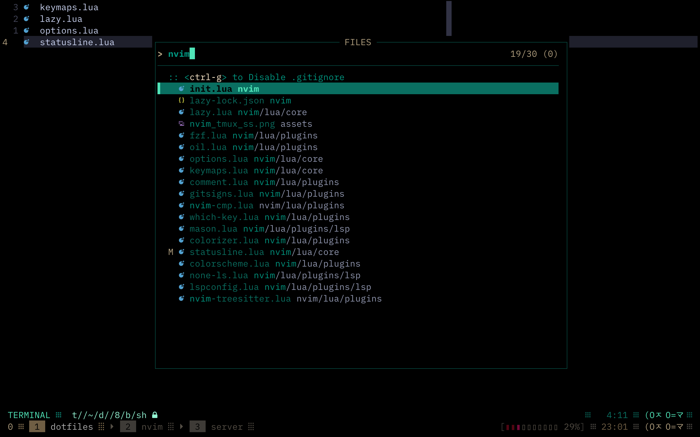
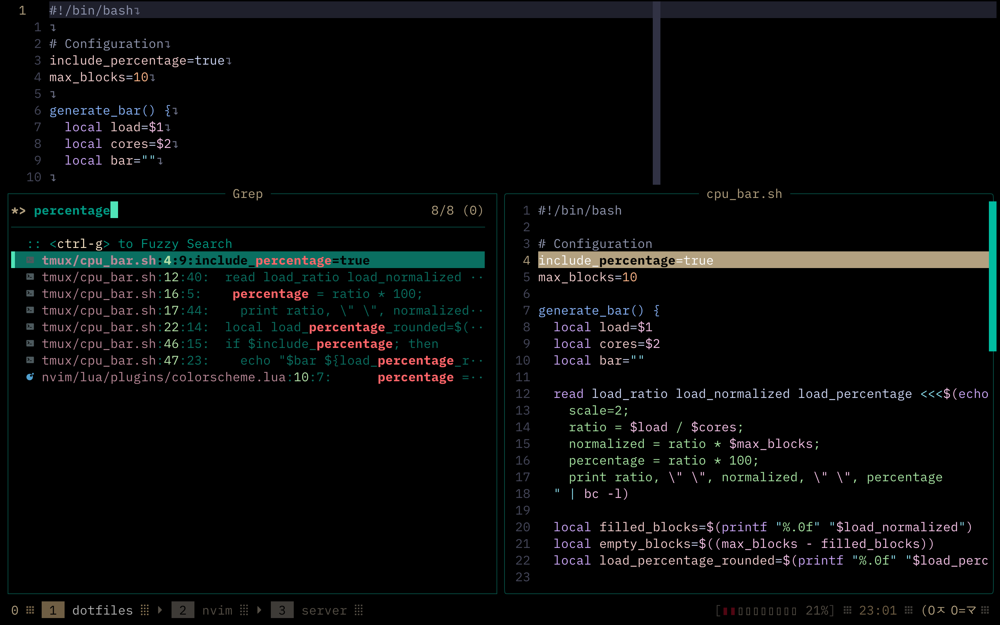
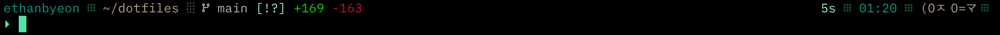
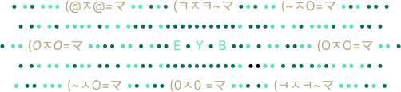

<h1 align="center">.dotfiles • 🔧(OㅈO=マ</h1>

---

<table>
  <tr>
    <td align="center">
      
      <p><strong>Nvim + Tmux</strong></p>
    </td>
    <td align="center">
      
      <p><strong>Fzf Lua File Search</strong></p>
    </td>
  </tr>
  <tr>
    <td align="center">
      
      <p><strong>Fzf Lua Find Preview</strong></p>
    </td>
    <td align="center">
      
      <p><strong>Fzf Lua Grep</strong></p>
    </td>
  </tr>
  <tr>
    <td colspan="2" align="center">
      
      <p><strong>Starship</strong></p>
    </td>
  </tr>
</table>

---

<p align="center">
    
</p>

---

## .setup

- OS: macOS Sequoia
- Terminal: [iTerm2](https://iterm2.com/)
- Shell: Zsh
- Prompt: [Starship](https://github.com/starship/starship)
- Terminal Multiplexer: [Tmux](https://github.com/tmux/tmux)
- Editor: [Neovim](https://neovim.io/)
- Fuzzy Finder: [fzf](https://github.com/junegunn/fzf)
- Colorscheme: [Catppuccin Mocha](https://github.com/catppuccin/catppuccin) (modified)
- Font: [JetBrainsMonoNL Nerd Font](https://www.nerdfonts.com/font-downloads)
- Icons: [NerdFonts](https://www.nerdfonts.com/)

## .file_structure

```
.
├── nvim/
├── starship/
├── tmux/
└── README.md
```

## .neovim

```
~/.config/nvim
├── lua/
│  ├── core/        # General settings, key mappings, and options
│  └── plugins/     # Plugin configurations
│     └── lsp/      # Language server-specific configurations
└── init.lua        # Main entry point for Neovim
```

### .plugins

- [Catppuccin](https://github.com/catppuccin/nvim): Customizable color scheme.
- [Colorizer](https://github.com/norcalli/nvim-colorizer.lua): Inline color code highlights.
- [Comment.nvim](https://github.com/numToStr/Comment.nvim): Quick comment toggling.
- [Fzf-Lua](https://github.com/ibhagwan/fzf-lua): Fuzzy file and buffer search.
- [Gitsigns](https://github.com/lewis6991/gitsigns.nvim): Git diff signs in the gutter.
- [Lazy.nvim](https://github.com/folke/lazy.nvim): Package manager.
- [Mason](https://github.com/williamboman/mason.nvim): Manages external tools and LSP servers.
- [None-ls](https://github.com/nvimtools/none-ls.nvim): Integrates external tools with LSP.
- [Nvim Cmp](https://github.com/hrsh7th/nvim-cmp): Auto-completion plugin.
- [Nvim Treesitter](https://github.com/nvim-treesitter/nvim-treesitter): Syntax highlighting.
- [Oil](https://github.com/stevearc/oil.nvim): Interactive file explorer.
- [Which-key](https://github.com/folke/which-key.nvim): Keybinding popup hints.

---

<p align="center">
••• (OㅈO=マ ••• E • Y • B • 🫰(~ㅈO=マ •••
</p>
